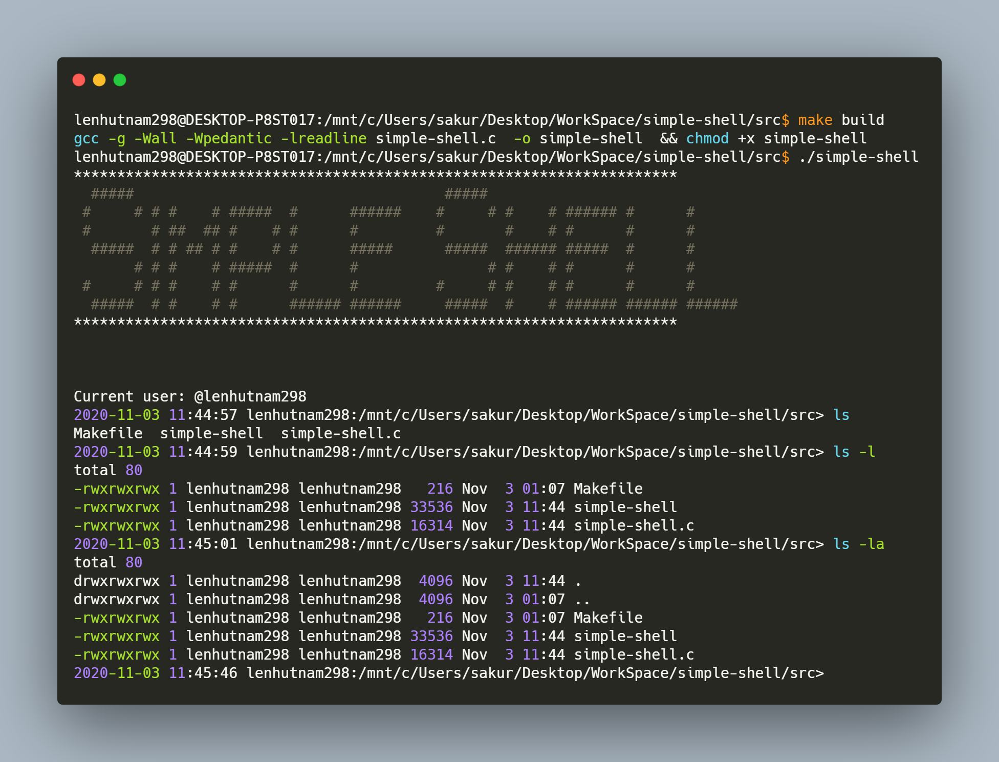
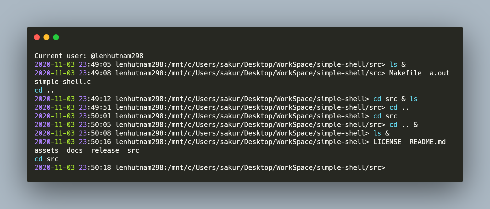
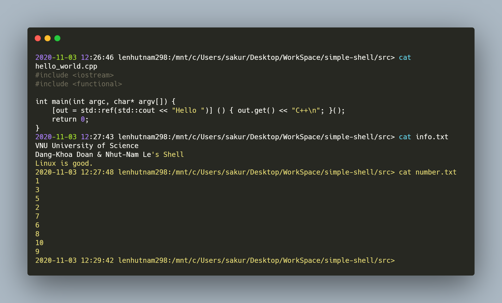
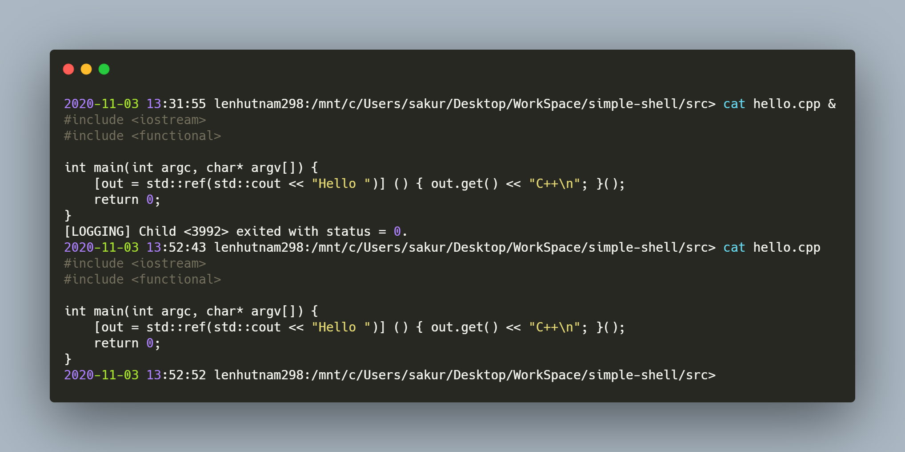
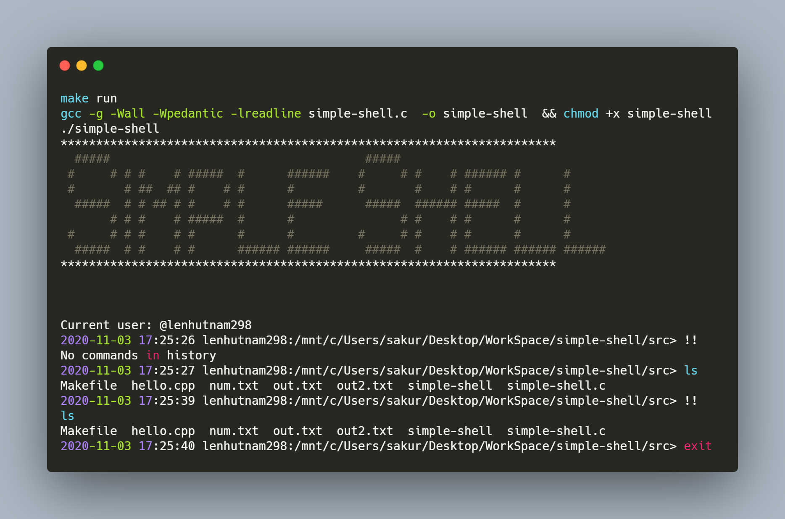
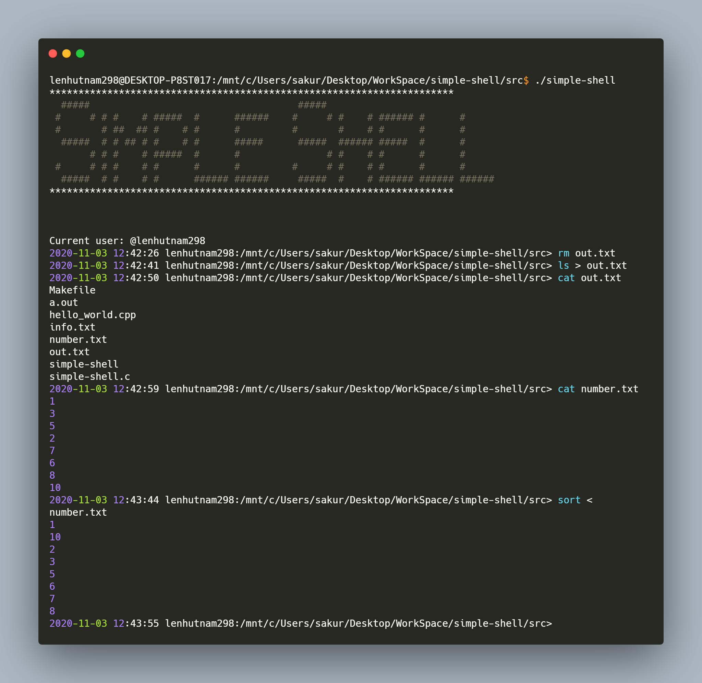
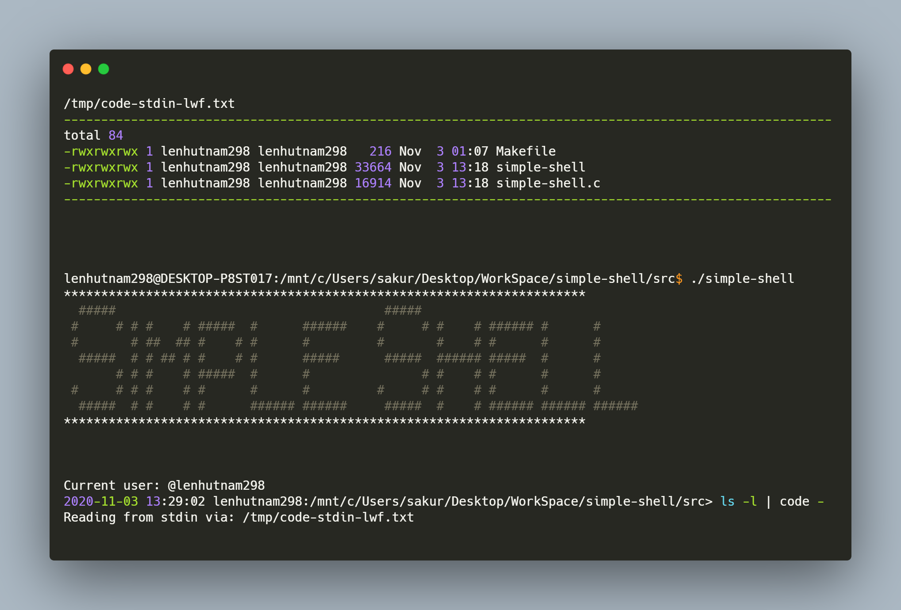
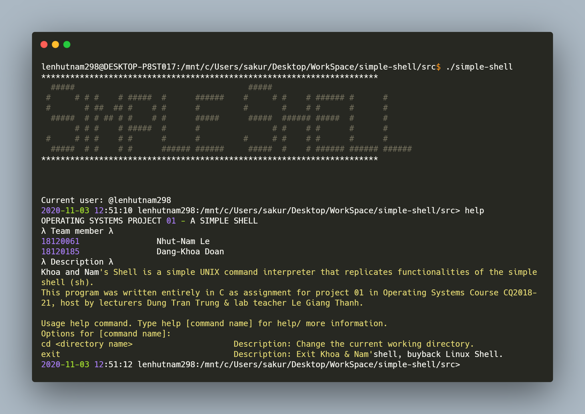

Objectives
-	Learn **Unix Shell**.
-	Learn Unix **Parent** and **Child Processes**.
-	Learn Unix **Input** and **Output redirections**.
-	Learn Unix **Pipe**.
-	Learn Unix **fork()**, **exec()**, **wait()**, **open()**, **close()**, **dup()**, and **pipe() system calls**.
-	Implement a **Simple Shell Application** using Unix system calls.

# Project 1 — Simple Shell
This is the first project of Operating System course

This project consists of designing a C program to serve as a shell interface that accepts user commands
and then executes each command in a separate process. Your implementation will support input and
output redirection, as well as pipes as a form of IPC between a pair of commands. Completing this project
will involve using the UNIX fork(), exec(), wait(), dup2(), and pipe() system calls and can be completed
on Linux system.

## I. Overview
A shell interface gives the user a prompt, after which the next command is entered. The example below
illustrates the prompt osh> and the user’s next command: cat prog.c. (This command displays the file
prog.c on the terminal using the UNIX cat command.)
```
osh>cat prog.c
```

One technique for implementing a shell interface is to have the parent process first read what the user
enters on the command line (in this case, cat prog.c) and then create a separate child process that performs
the command. Unless otherwise specified, the parent process waits for the child to exit before continuing.
However, UNIX shells typically also allow the child process to run in the background, or concurrently.
To accomplish this, we add an ampersand (&) at the end of the command. Thus, if we rewrite the above
command as
```
osh>cat prog.c &
```
The parent and child processes will run concurrently
The separate child process is created using the fork() system call, and the user’s command is executed
using one of the system calls in the exec() family.
A C program that provides the general operations of a command-line shell is supplied as below listing
code:
```c
#include <stdio.h>
#include <unistd.h>
#define MAX LINE 80 /* The maximum length command */
int main(void)
{
  char *args[MAX LINE/2 + 1]; /* command line arguments */
  int should run = 1; /* flag to determine when to exit program */
  while (should run) {
    printf("osh>");
    fflush(stdout);
    /**
    * After reading user input, the steps are:
    * (1) fork a child process using fork()
    * (2) the child process will invoke execvp()
    * (3) parent will invoke wait() unless command included &
    */
  }
  return 0;
}
```
The main() function presents the prompt osh-> and outlines the steps to be taken after input from the
user has been read. The main() function continually loops as long as should run equals 1; when the user
enters exit at the prompt, your program will set should run to 0 and terminate.
This project is organized into several parts:
1. Creating the child process and executing the command in the child
2. Providing a history feature
3. Adding support of input and output redirection
4. Allowing the parent and child processes to communicate via a pipe

## II. Executing Command in a Child Process
The first task is to modify the main() function so that a child process is forked and executes the command
specified by the user. This will require parsing what the user has entered into separate tokens and storing
the tokens in an array of character strings. For example, if the user enters the command ps -ael at the
osh> prompt, the values stored in the args array are:
```
args[0] = "ps"
args[1] = "-ael"
args[2] = NULL
```
This args array will be passed to the execvp() function, which has the following prototype:
```
execvp(char *command, char *params[])
```
Here, command represents the command to be performed and params stores the parameters to this
command. For this project, the execvp() function should be invoked as execvp(args[0], args). Be sure to
check whether the user included & to determine whether or not the parent process is to wait for the child
to exit.

## III. Creating a History Feature
The next task is to modify the shell interface program so that it provides a history feature to allow a user
to execute the most recent command by entering !!. For example, if a user enters the command ls -l, she
can then execute that command again by entering !! at the prompt. Any command executed in this fashion
should be echoed on the user’s screen, and the command should also be placed in the history buffer as
the next command. Your program should also manage basic error handling. If there is no recent command
in the history, entering !! should result in a message “No commands in history.”

## IV. Redirecting Input and Output
Your shell should then be modified to support the ‘>’ and ‘<’ redirection operators, where ‘>’ redirects
the output of a command to a file and ‘<’ redirects the input to a command from a file. For example, if a
user enters
```
osh>ls > out.txt
```
the output from the ls command will be redirected to the file out.txt. Similarly, input can be redirected as
well. For example, if the user enters
```
osh>sort < in.txt
```
the file in.txt will serve as input to the sort command.
Managing the redirection of both input and output will involve using the dup2() function, which
duplicates an existing file descriptor to another file descriptor. For example, if fd is a file descriptor to
the file out.txt, the call
```
dup2(fd, STDOUT FILENO);
```
duplicates fd to standard output (the terminal). This means that any writes to standard output will in fact
be sent to the out.txt file.
You can assume that commands will contain either one input or one output redirection and will not
contain both. In other words, you do not have to be concerned with command sequences such as sort <
in.txt > out.txt.

## V. Communication via a Pipe
The final modification to your shell is to allow the output of one command to serve as input to another
using a pipe. For example, the following command sequence
```
osh>ls -l | less
```
has the output of the command ls -l serve as the input to the less command. Both the ls and less commands
will run as separate processes and will communicate using the UNIX pipe() function. Perhaps the easiest way to create these separate processes is to have the parent process create the child process (which will
execute ls -l). This child will also create another child process (which will execute less) and will establish
a pipe between itself and the child process it creates. Implementing pipe functionality will also require
using the dup2() function as described in the previous section. Finally, although several commands can
be chained together using multiple pipes, you can assume that commands will contain only one pipe
character and will not be combined with any redirection operators.

## 📘 Task
| # | Requirement content                                 | Status 🔨 |
| --- | ---------------------------------------- | ------------ |
| 1   | Write a C program simple-shell.c that implements above specifications              | Done   |
| 2   | You will submit this assignment on Moodle. A skeleton of simple-shell.c program has also been added on Moodle.             | Done   |
| 3   | You can download and run this example simple-shell to get an idea what is expected from you in this assignment. This example program has been built and tested in Linux Debian machines available in the lab. Run this program in other kind of machines at your own risks.             | Done  |
| 4   | Make sure your program compiles and runs error and warning free              | Done   |
| 5   | Test your program to make sure your code has fulfilled the specifications.              | Done   |
| 6   | Organize and comment your code to make it easy to understand.              | Done   |
| 7   | Demonstrate your program to report file.              | Done   |

## 📘 Testing

### Operating System

Nhut Nam test on Ubuntu dual Windows 10 and WSL

Dang Khoa test on Zorin dual Windows 10

<a>
  
  
</a>

<a>
  
</a>

Compiler: GCC >= 7.5.0

<a>
  
</a>

### Executing Command in a Child Process


*Figure 01: Executing Command in a Child Process*


*Figure 02: Executing Command in a Child Process*





### Creating a History Feature



### Redirecting Input and Output


*Figure 03: Input/ Output redirection*

###  Two commands with a pipe


*Figure 04: Two commands with a pipe*

###  Built-in commands


*Figure 04: Help with builtin commands*


*Figure 05: Change directory with builtin commands*

## 📑 Evaluation
| Demonstration | Commands  💻                              | Marks❄️| Status 🔨 |
| --- | ---------------------------------------- | ------------ |------------ |
|  | Simple commands with child processes    | 30 | Completed |
|  | Simple command with &    | 5 |Completed |
|  | Output redirection    | 15 |Completed |
|  | Input redirection    | 15 |Completed |
|  | Two commands with a pipe    | 15 |Completed |
| Code Quality, Comments, Report the result in file (screenshot) |    | 20 |Completed |
| Total |    | 100 |Completed |

## ✳️ References
🐧 [Linux man pages](https://linux.die.net/man/) <br>
🐧 [EnthusiastiCon - Stefanie Schirmer “OMG building a shell in 10 minutes”](https://www.youtube.com/watch?v=k6TTj4C0LF0)<br>
🐧 [Writing a Unix Shell - Part I](https://indradhanush.github.io/blog/writing-a-unix-shell-part-1/)<br>
🐧 [Writing a Unix Shell - Part II](https://indradhanush.github.io/blog/writing-a-unix-shell-part-2/)<br>
🐧 [Writing a Unix Shell - Part III](https://indradhanush.github.io/blog/writing-a-unix-shell-part-3/)<br>
🐧 [Tutorial - Write a Shell in C by Stephen Brennan • 16 January 2015](https://brennan.io/2015/01/16/write-a-shell-in-c/)<br>
